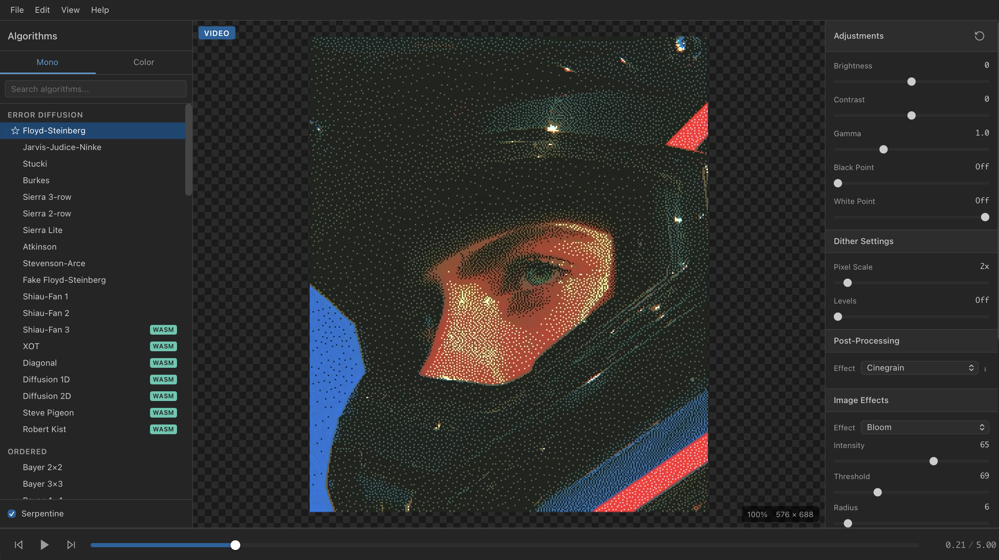

# ditherme

A browser-first dithering application for images and video, with an optional
Electron desktop add-on.



## Alpha Status

ditherme is an early alpha. It is useful for experimentation and creative
workflows, but behavior, performance, and file compatibility can still change.
The web app is the primary product. Electron packages are an optional desktop
wrapper around the same renderer.

This project was inspired by
[Ditherista](https://github.com/robertkist/ditherista). It started as a hobby
project because I wanted an offline-first dithering tool with video support.
Core image processing runs locally. The experimental FFmpeg video fallback
downloads its runtime assets when a browser cannot use the primary WebCodecs
path, so video fallback processing may require network access.

## Features

- Image loading and export for PNG, JPEG, GIF, BMP, and WebP
- 90+ dithering algorithms, including error diffusion, ordered, Riemersma, pattern, and color methods
- WASM acceleration with JavaScript fallbacks
- Preset, custom, generated, imported, and exported palettes
- Brightness, contrast, gamma, saturation, black/white point, and image effects
- Batch image processing
- Video playback and export where browser capabilities permit
- Browser application with an optional Electron desktop add-on for macOS, Linux, and Windows

## Currently in Development

- [ ] Scripting API stabilization. The experimental API is disabled in this alpha.
- [ ] FFmpeg video fallback metadata and codec coverage across browsers.
- [ ] Electron packaging, auto-update, signing, and notarization polish.

## Known Limitations

- Video loading is limited to 45 seconds in the current alpha.
- WebCodecs provides the preferred video path; the FFmpeg fallback is experimental.
- Electron alpha packages may be unsigned and can trigger operating-system security warnings.
- The application is distributed under GPL-2.0-or-later to align with the
  bundled FFmpeg fallback. See [LICENSE](LICENSE) and
  [THIRD-PARTY-NOTICES.md](THIRD-PARTY-NOTICES.md).
- The scripting API is not available in this release.

## Installation

### Web app

```bash
npm install
npm run dev
```

To create and preview a production web build:

```bash
npm run build
npm run preview
```

The generated `dist/` directory can be served as a root-hosted static site.

### Electron add-on

```bash
npm run dev:electron
npm run build:electron
```

Platform-specific packaging commands are also available:

```bash
npm run build:mac
npm run build:linux
npm run build:win
```

## Development

```bash
npm run typecheck:all
npm test
```

The WASM artifacts are checked into `public/wasm/` for the alpha release. The
source and toolchain needed for a reproducible libdither rebuild are tracked as
future work; see `wasm/build.sh` and the third-party notices.

## License

The application is released under the [GNU General Public License v2.0 or
later](LICENSE). Bundled and downloaded third-party components have additional
terms documented in
[THIRD-PARTY-NOTICES.md](THIRD-PARTY-NOTICES.md).
